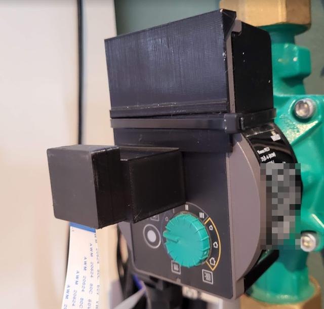
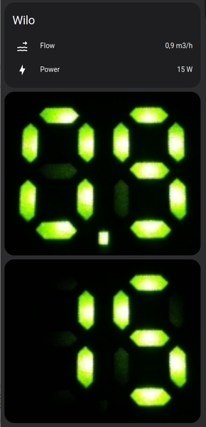
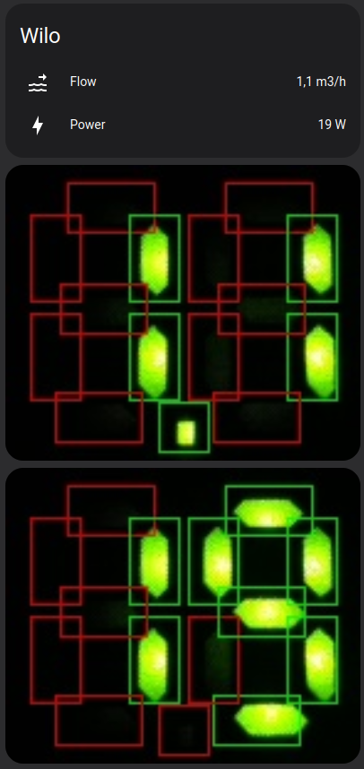

To read out the Wilo Yonoc Pico pump some parts are required:
- Raspberry Pi and camera (the v2.1 NOIR was used here)
- 3D printed camera holder and pump mount. The camera holder is connected to th epumpo mount using m2x5 screws, but the designs can be merged as well. The pump mount is secured to th epump using a zip tie. 
- The readout software. This is a Python script that captures images from the camera, analyzes the 7 segment display, and publishes over mqtt. 

The default crop and segment locations should provide a decent starting point. The crop area can be adjusted, as well as the approximate segment positions, in the wilo.py file. To ease setup, the segment regions can be drawn in the image. 

The OCR algorith is low on processor requirements, it will probably run on an ESP32/espcam or similar as well. 

Camera on pump:

Pump in home assistant:

